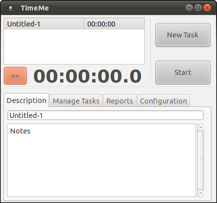
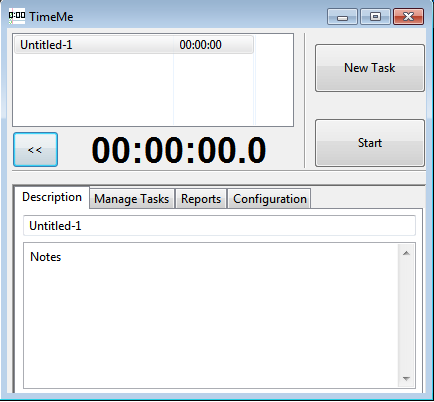
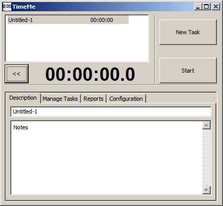
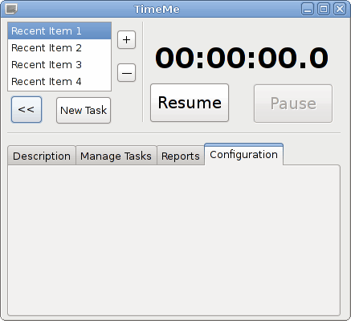
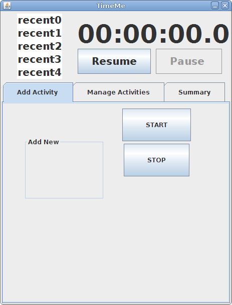

# TimeMe
###### _Track time spent on tasks (Java)_
Open source Java-based time-tracking event list.

## 2013 Update: 
Moved project from [Google Code](https://code.google.com/archive/a/eclipselabs.org/p/timeme) to [GitHub](https://github.com/mittman/timeme)

## Quick links:
#### Download - [TimeMe 1.1 JAR](jars/TimeMe_1.1.jar)
#### Documentation - [Software Requirements Specification (SRS)](docs/TimeMe_SRS.pdf)
#### Overview - [Slide Presentation](docs/TimeMe_present.pdf)

## Screenshots:

## Wiki:
#### [Eclipse integration]()
#### [Using SWT in Eclipse]()
#### [Cross-platform packaging]()
#### [Recursively change commit author]()
#### [Print git commits to PDF]()
#### [Generate git statistics]()

## Prototypes:

----------
## Copyright and License
The project was created on Feb 29, 2012.

Dual-licensed under the [Apache 2.0](LICENSE) and the [GPL v3](COPYING) licenses.
