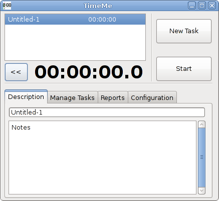

# TimeMe
###### _Track time spent on tasks (Java)_
Open source Java-based time-tracking event list.

## 2013 Update: 
Moved project from [Google Code](https://code.google.com/archive/a/eclipselabs.org/p/timeme) to [GitHub](https://github.com/mittman/timeme)

## Quick links:
#### Download - [TimeMe 1.1 JAR](https://github.com/mittman/timeme/raw/master/jars/TimeMe_1.1.jar)
#### Documentation - [Software Requirements Specification (SRS)](files/TimeMe_SRS.pdf)
#### Overview - [Slide Presentation](files/TimeMe_present.pdf)

## Screenshots:

## Wiki:
#### [Eclipse integration](https://github.com/mittman/timeme/wiki/Eclipse)
#### [Using SWT in Eclipse](https://github.com/mittman/timeme/wiki/SWT)
#### [Cross-platform packaging](https://github.com/mittman/timeme/wiki/Packaging)
#### [Recursively change commit author](https://github.com/mittman/timeme/wiki/GIT-Tricks#Recursively_change_commit_author)
#### [Print git commits to PDF](https://github.com/mittman/timeme/wiki/GIT-Tricks#Print_git_commits_to_PDF)
#### [Generate git statistics](https://github.com/mittman/timeme/wiki/GIT-Tricks#Generate_git_statistics)

## Prototypes:
###### SWT

###### SWING

----------
## Copyright and License
The project was created on Feb 29, 2012.

Dual-licensed under the [Apache 2.0](LICENSE) and the [GPL v3](COPYING) licenses.
